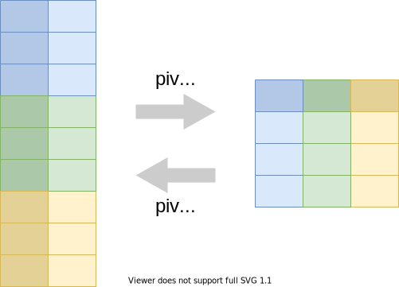
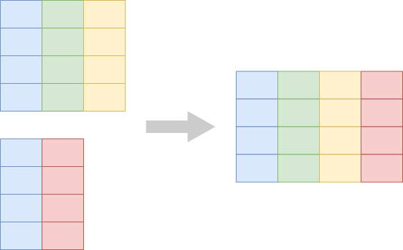
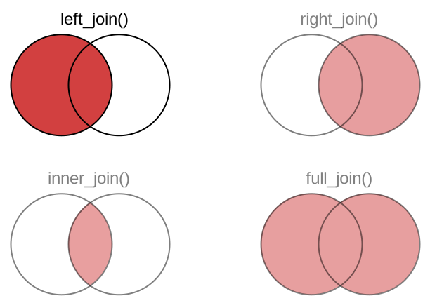

```{r setup, include=FALSE, echo=FALSE}
options(htmltools.dir.version = FALSE)
knitr::opts_chunk$set(comment = "")

library(tidyverse)
library(naniar)
library(palmerpenguins)
```


## Elementary data manipulations

.pull-left[
So far today:

- Pick rows: `filter()`
- Pick columns: `select()`
- Sort rows: `arrange()`
- Count things: `count()`
- Make new columns: `mutate()`
]

---

## Elementary data manipulations

.pull-left[
So far today:

- Pick rows: `filter()`
- Pick columns: `select()`
- Sort rows: `arrange()`
- Count things: `count()`
- Make new columns: `mutate()`
]

.pull-right[
Next:

- Analyze subsets:<br>`group_by()` and `summarize()`
]

---

## Elementary data manipulations

.pull-left[
So far today:

- Pick rows: `filter()`
- Pick columns: `select()`
- Sort rows: `arrange()`
- Count things: `count()`
- Make new columns: `mutate()`
]

.pull-right[
Next:

- Analyze subsets:<br>`group_by()` and `summarize()`
- Reshape:<br>`pivot_wider()`, `pivot_longer()`
]

---

## Elementary data manipulations

.pull-left[
So far today:

- Pick rows: `filter()`
- Pick columns: `select()`
- Sort rows: `arrange()`
- Count things: `count()`
- Make new columns: `mutate()`
]

.pull-right[
Next:

- Analyze subsets:<br>`group_by()` and `summarize()`
- Reshape:<br>`pivot_wider()`, `pivot_longer()`
- Combine datasets:<br>`left_join()`, `inner_join()`, `...`
]

---


## Elementary data manipulations

.pull-left[
So far today:

- Pick rows: `filter()`
- Pick columns: `select()`
- Sort rows: `arrange()`
- Count things: `count()`
- Make new columns: `mutate()`
]

.pull-right[
Next:

- Analyze subsets:<br>`group_by()` and `summarize()`
- Reshape:<br>`pivot_wider()`, `pivot_longer()`
- Combine datasets:<br>`left_join()`, `inner_join()`, `...`
- *Bonus* working with missing values: `is.na()`, `replace_na()`, `...`
]

---

## Analyze subsets: `group_by()` and `summarize()`

<br>

.center[
</img>
]

---

## Example application of grouping: Counting

Previously, we counted like so:

.tiny-font[

```{r eval = FALSE}
penguins %>%
  count(species)
```

```{r echo = FALSE}
# for some reason this data frame has row names, which are indicated with
# an asterisk, which shows up as a highlighted row
x <- penguins %>%
  count(species)

row.names(x) <- NULL
x
```
]

--

Now let's do it the hard way


---

## Example application of grouping: Counting

Let's go back to the raw data:

.tiny-font[

```{r}
penguins
```
]


---

## Example application of grouping: Counting

Let's group it:

.tiny-font[

```{r}
penguins %>%
  group_by(species)
```
]


---

## Example application of grouping: Counting

And summarize:

.tiny-font[

```{r eval = FALSE}
penguins %>%
  group_by(species) %>%
  summarize(
    n = n()  # n() returns the number of observations per group
  )
```

```{r echo = FALSE}
# remove row names
x <- penguins %>%
  group_by(species) %>%
  summarize(
    n = n()
  )

row.names(x) <- NULL
x
```

]


---

## Example application of grouping: Counting

Now let's group by multiple variables:

.tiny-font[

```{r}
penguins %>%
  group_by(species, island)
```
]

---

## Example application of grouping: Counting

And summarize:

.tiny-font[

```{r}
penguins %>%
  group_by(species, island) %>%
  summarize(
    n = n()  # n() returns the number of observations per group
  )
```

]


---

## Example application of grouping: Counting

`count(...)` is a short-cut for `group_by(...) %>% summarize(n = n())`

--

.tiny-font.pull-left[

```{r eval = FALSE}
penguins %>%
  count(species)
```

```{r echo = FALSE}
# remove row names
x <- penguins %>%
  count(species)

row.names(x) <- NULL
x
```

]

--

.tiny-font.pull-right[

```{r eval = FALSE}
penguins %>%
  group_by(species) %>%
  summarize(
    n = n()
  )
```

```{r echo = FALSE}
# remove row names
x <- penguins %>%
  group_by(species) %>%
  summarize(
    n = n()
  )

row.names(x) <- NULL
x
```

]

--

The output is exactly the same

---

## Performing multiple summaries at once

--

.tiny-font[

```{r eval = FALSE}
penguins %>%
  group_by(species) %>%
  summarize(
    n = n(),                                      # number of penguins
    mean_mass = mean(body_mass_g),                # mean body mass
    max_flipper_length = max(flipper_length_mm),  # max flipper length
    percent_female = sum(sex == "female")/n()     # percent of female penguins
  )
```
]

--

.tiny-font[

```{r echo = FALSE}
# remove row names
x <- penguins %>%
  group_by(species) %>%
  summarize(
    n = n(),                                      # number of penguins
    mean_mass = mean(body_mass_g),                # mean body mass
    max_flipper_length = max(flipper_length_mm),  # max flipper length
    percent_female = sum(sex == "female")/n()     # percent of female penguins
  )

row.names(x) <- NULL
x
```

]

--

Each statement in `summarize()` creates one new column

--

But why all the `NA`s?

---

## Performing multiple summaries at once

.tiny-font[

```{r eval = FALSE}
penguins %>%
  group_by(species) %>%
  summarize(
    n = n(),
    mean_mass = mean(body_mass_g, na.rm = TRUE),
    max_flipper_length = max(flipper_length_mm, na.rm = TRUE),
    percent_female = sum(sex == "female", na.rm = TRUE)/sum(!is.na(sex))
  )
```
]

.tiny-font[

```{r echo = FALSE}
# remove row names
x <- penguins %>%
  group_by(species) %>%
  summarize(
    n = n(),
    mean_mass = mean(body_mass_g, na.rm = TRUE),
    max_flipper_length = max(flipper_length_mm, na.rm = TRUE),
    percent_female = sum(sex == "female", na.rm = TRUE)/sum(!is.na(sex))
  )

row.names(x) <- NULL
x
```

]

We typically need to tell R how exactly `NA`s should be handled. More on this in a moment.

[//]: # "segment ends here"

---
class: center middle

## Reshaping: Making tables wider or longer

---

## Reshape: `pivot_wider()` and `pivot_longer()`

<br>

.center[
</img>
]


---

## Reshaping example: Making a wide summary table


.tiny-font[

```{r}
penguins %>%
  count(species, island)
```
]

---

## Reshaping example: Making a wide summary table

.tiny-font[

```{r}
penguins %>%
  count(species, island) %>%
  pivot_wider(names_from = "island", values_from = "n")
```
]

The `NA`s indicate cases that don't exist

---

## And going back to long format

.tiny-font[

```{r}
penguins_wide <- penguins %>%
  count(species, island) %>%
  pivot_wider(names_from = "island", values_from = "n")

penguins_wide %>% 
  pivot_longer(cols = -species, names_to = "island", values_to = "n")
```
]


---

## And going back to long format

Column specifications work just like in `select()`:

.tiny-font[

```{r}
# specify columns by subtraction
penguins_wide %>% 
  pivot_longer(cols = -species, names_to = "island", values_to = "n")
```
]


---

## And going back to long format

Column specifications work just like in `select()`:

.tiny-font[

```{r}
# specify columns by explicit listing
penguins_wide %>% 
  pivot_longer(cols = c(Biscoe, Dream, Torgersen), names_to = "island", values_to = "n")
```

]

---

## And going back to long format

Column specifications work just like in `select()`:

.tiny-font[

```{r}
# specify columns by range
penguins_wide %>% 
  pivot_longer(cols = Biscoe:Torgersen, names_to = "island", values_to = "n")
```

]

[//]: # "segment ends here"

---
class: center middle

## Combining datasets: joins


---

## We use joins to add columns from one table into another

.center[
</img>
]


---

## Example: band members and their instruments

.tiny-font.pull-left[
```{r}
# some members of famous bands
band_members
```
]

--

.tiny-font.pull-right[
```{r}
# instruments played by some band members
band_instruments
```
]

--

.tiny-font[
```{r}
left_join(band_members, band_instruments) # add right table to left
```
]

---

## Example: band members and their instruments

.tiny-font.pull-left[
```{r}
# some members of famous bands
band_members
```
]

.tiny-font.pull-right[
```{r}
# instruments played by some band members
band_instruments
```
]

.tiny-font[
```{r}
right_join(band_members, band_instruments) # add left table to right
```
]


---

## Example: band members and their instruments

.tiny-font.pull-left[
```{r}
# some members of famous bands
band_members
```
]

.tiny-font.pull-right[
```{r}
# instruments played by some band members
band_instruments
```
]

.tiny-font[
```{r}
inner_join(band_members, band_instruments) # keep intersection only
```
]


---

## Example: band members and their instruments

.tiny-font.pull-left[
```{r}
# some members of famous bands
band_members
```
]

.tiny-font.pull-right[
```{r}
# instruments played by some band members
band_instruments
```
]

.tiny-font[
```{r}
full_join(band_members, band_instruments) # merge all cases
```
]


---

## The different joins at a glance

.center[
</img>
]


---

## The different joins at a glance

</img>

<br>

**Tip:** In case of doubt, use `left_join()`

--

Made up stat: `left_join()` is the right choice  
70–80% of the time.

[//]: # "segment ends here"

---


## Working with missing values in R

---

## R propagates missingness

```{r}
x <- c(1, 2, NA, 4)

sum(x)
```

--

```{r}
mean(x)
```

--

```{r}
x == 2
```


---

## Many functions allow explicit exclusion of `NA` values

```{r}
x <- c(1, 2, NA, 4)

sum(x, na.rm = TRUE)
```

--

```{r}
mean(x, na.rm = TRUE)
```

--

But is this the right thing to do?

---

## There is no general right or wrong approach

```{r}
x <- c(2, 1, 1, 2, 1, 1, 1, 2, NA, 1, 2, 1, 1, 2, 1, 1, 1, 2)
mean(x, na.rm = TRUE)
```

--

```{r}
x <- c(NA, NA, NA, 2, NA, NA, NA, NA, NA, 1, NA, NA, NA, NA)
mean(x, na.rm = TRUE)
```

--

R's default is conservative: If there's at least one `NA`, the result is `NA`

---

## We need to use `is.na()` to check for missing values

.small-font[
```{r}
c(1, 2, NA, 4) == NA   # does not work
is.na(c(1, 2, NA, 4))  # works
```
]

---

## There are several missing values of different types

- `NA`: logical constant indicating missing value

- `NA_integer_`: missing integer

- `NA_real_`: missing real

- `NA_complex_`: missing complex value

- `NA_character_`: missing string


---

## Sometimes the type matters

```{r}
c(1, 2, NA)
c(1, 2, NA_real_)
c(1, 2, NA_character_)
```

---

## Sometimes the type matters

.small-font[
This does not work, type mismatch:
```{r}
#if_else(TRUE, "result if true", NA)
```

This works:
```{r}
if_else(TRUE, "result if true", NA_character_)
```
]

--

.small-font[
Similarly:
```{r}
#if_else(TRUE, 1234, NA)      # does not work
if_else(TRUE, 1234, NA_real_) # works
```
]

---

## Replacing `NA` values

Remember from class on data wrangling:

.small-font[
```{r, message = FALSE}
band_data <- full_join(band_members, band_instruments)
band_data
```
]

---

## Replacing `NA` values

Replace `NA`s with empty strings in `plays` column:

.small-font[
```{r}
band_data %>%
  mutate(plays = replace_na(plays, ""))
```
]


---

## Replacing `NA` values

Replace `NA`s with empty strings in all columns:

.small-font[
```{r}
band_data %>%
  mutate(across(everything(), ~replace_na(.x, "")))
```
]

---

## Replacing `NA` values

Replace empty strings with `NA` in `plays` column (requires **naniar** package):

.small-font[
```{r}
band_data %>%
  mutate(across(everything(), ~replace_na(.x, ""))) %>%
  replace_with_na_at("plays", ~.x == "")
```
]

---

## Replacing `NA` values

Replace empty strings with `NA` in all columns (requires **naniar** package):

.small-font[
```{r}
band_data %>%
  mutate(across(everything(), ~replace_na(.x, ""))) %>%
  replace_with_na_all(~.x == "")
```
]

---

## Removing rows with `NA` values

Remove all rows with any `NA`s with `na.omit()`:

.small-font[
```{r}
band_data %>%
  na.omit()
```
]

---

## Removing rows with `NA` values

Remove all rows where specific columns contain `NA`s:

.small-font[
```{r}
band_data %>%
  filter(!is.na(plays))
```
]

---

## Removing rows with `NA` values

Conversely:

.small-font[
```{r}
band_data %>%
  filter(is.na(plays))
```
]

---

## Exercise

Time to try it out yourself!

## Exercise

Go to [https://elsherbini.github.io/AMNH_R_Workshop_2023/modules/data-wrangling-module/](https://elsherbini.github.io/AMNH_R_Workshop_2023/modules/data-wrangling-module/) and complete the  
"Data Wrangling 2" exercise.