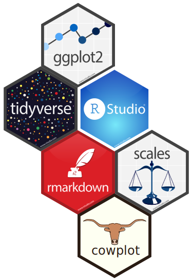

```{r setup, include=FALSE, echo=FALSE}
options(htmltools.dir.version = FALSE)
knitr::opts_chunk$set(comment = "")

library(tidyverse)
library(lubridate)
library(cowplot)
library(colorspace)
library(here)
library(ggridges)
library(ggforce)
library(ggbeeswarm)
# ggplot2 settings so plots scale well for slide size 
theme_set(theme_gray(16)) # 16 for full width, 18 for half width 
update_geom_defaults("point", list(size = 2)) # 2 for full width, 2.5 for half width

# this function should be added to cowplot
align_legend <- function(p, hjust = 0.5)
{
  # extract legend
  g <- cowplot::plot_to_gtable(p)
  grobs <- g$grobs
  legend_index <- which(sapply(grobs, function(x) x$name) == "guide-box")
  legend <- grobs[[legend_index]]

  # extract guides table
  guides_index <- which(sapply(legend$grobs, function(x) x$name) == "layout")

  # there can be multiple guides within one legend box  
  for (gi in guides_index) {
    guides <- legend$grobs[[gi]]
    
    # add extra column for spacing
    # guides$width[5] is the extra spacing from the end of the legend text
    # to the end of the legend title. If we instead distribute it by `hjust:(1-hjust)` on
    # both sides, we get an aligned legend
    spacing <- guides$width[5]
    guides <- gtable::gtable_add_cols(guides, hjust*spacing, 1)
    guides$widths[6] <- (1-hjust)*spacing
    title_index <- guides$layout$name == "title"
    guides$layout$l[title_index] <- 2

    # reconstruct guides and write back
    legend$grobs[[gi]] <- guides
  }
  
  # reconstruct legend and write back
  g$grobs[[legend_index]] <- legend
  g
}

income_by_age <- readRDS(here("datasets", "income_by_age.rds"))

titanic <- read_csv(here("datasets", "titanic.csv")) %>%
  select(age, sex, class, survived) %>%
  arrange(age, sex, class)

lincoln_temps <- readRDS(here("datasets", "lincoln_temps.rds"))
```


---

<br>

.center[
</img>
]


---

## What is R?

R is a general purpose programming language that's really well suited to statistics, manipulating tabular data, and plotting.


---


## Why R?

--

</img>

</img>

???

The R logo [is distributed](https://www.r-project.org/logo/) under the terms of the Creative Commons Attribution-ShareAlike 4.0 International license ([CC-BY-SA 4.0](https://creativecommons.org/licenses/by-sa/4.0/)).

RStudio hex stickers [are distributed](https://github.com/rstudio/hex-stickers) under [CC0.](https://github.com/rstudio/hex-stickers/blob/master/LICENSE.md)

--

</img>
---


[//]: # "segment ends here"

## Obtaining R


Windows, Mac or Linux OS: https://www.r-project.org

.center[
</img>
]
---

# Running R

.pull-left[
## Command line
 - from the command line, just type R
 - interactive session, nothing is saved by default

## Rstudio
- RStudio: http://www.rstudio.com
- Makes working with R much easier, particularly for a new R user
]
.pull-right[
##VSCode
- https://code.visualstudio.com/download
- not a full IDE, but you can customize it with extensions
- Guide on setting up VSCode for R programming: https://renkun.me/2019/12/11/writing-r-in-vscode-a-fresh-start/ and https://renkun.me/2022/03/06/my-recommendations-of-vs-code-extensions-for-r/
]
---

## The first core concept: Markdown

--

**Input:**

.small-font[
```
This is a sentence in Markdown, containing `code`, **bold text**,
and *italics*.
```
]


--

**Output:**

.small-font[
This is a sentence in Markdown, containing `code`, **bold text**, and *italics*.
]

---

## The first core concept: Markdown

.pull-left[
**Input:**

.small-font[
```
## 1 Introduction

Data visualization is part art 
and part science. The challenge 
is to get the art right without
getting the science wrong and 
vice versa.
```
]]


.pull-right[
**Output:**

## 1 Introduction

Data visualization is part art 
and part science. The challenge 
is to get the art right without
getting the science wrong and 
vice versa.

]


.absolute-bottom-right[
Text taken from: C. O. Wilke, [Fundamentals of Data Visualization](https://clauswilke.com/dataviz/introduction.html)
]

---

## R Markdown combines Markdown and R code

--

**Input:**

.small-font[

````
The function `rnorm()` creates normal variates.
`r ''````{R}
rnorm(5) # create 5 normal variates
```
````
]

--

**Output:**

.small-font[

The function `rnorm()` creates normal variates.
```{R}
rnorm(5) # create 5 normal variates
```
]

[//]: # "segment ends here"

---

## Using RStudio

If you haven't already, go to https://posit.cloud/content/5195221 and "Save a Permanent Copy"

Then click on "install_for_workshop.R" on the bottom right file viewer, and go to Code -> Source

---
## Using RStudio

.center[
</img>
]

---

## Using RStudio

.center[
</img>
]

---

## Knitting an R Markdown file

.center[
</img>
]

---

## Knitting an R Markdown file

.center[
</img>
]

---


## Knitting an R Markdown file

.center[
</img>
]

---

## Knitting to pdf

.center[
</img>
]

---

## Knitting to pdf

.center[
</img>
]

---

## Knitting to pdf

.center[
</img>
]

---

## Knitting to pdf

.center[
</img>
]

---

## Further reading

- [R Markdown tutorial](https://rmarkdown.rstudio.com/lesson-2.html)
- [R Markdown cheatsheet](https://github.com/rstudio/cheatsheets/raw/main/rmarkdown.pdf)
- [R Markdown book](https://bookdown.org/yihui/rmarkdown/)

---

# Using R as a calculator

The simplest thing you can do with R is arithmetic

```{r arithmetic}

# + - / * for basic arithmetic
# ** for exponents, sqrt, pi, log10, and more
100 + 1

```

---

## What percentage of your life have you spent in higher education (after grade school) as a student or trainee?

1. Create a new R markdown file (File -> New File -> R Markdown) and delete everything after the first five line header.

2. Create a new chunk by going to Code -> Insert Chunk or hitting Ctrl + Alt + i

3. Make an arithmetic expression to calculate the percentage

```{r eval=FALSE}
10 + 4 # you can add 
10 - 4 # subtract
4 / 2 # divide
2 * 5 # multiply
3 ^ 4 # and exponentiate
# remember PEMDAS!
y <- (3 + 4) * 7 + 3
```


---

# The `tidyverse`

The tidyverse is a collection of packages that all work together to make data science easier and more sensical in R.

</img>

---

</img>

---

</img>

---

</img>

---

# Getting help

You can get help for a function by using `?` in front

```{r eval=FALSE}
?sqrt
```

--

**CHEATSHEETS!** If there were one take away from today and tomorrow, it'd be to print these and hang them by your desk.

https://posit.co/resources/cheatsheets/

Can also find the cheatsheets from inside RStudio: Help -> Cheat Sheets -> Browse Cheat Sheets

--

**When googling an R question, add "tidyverse" to your search**

---